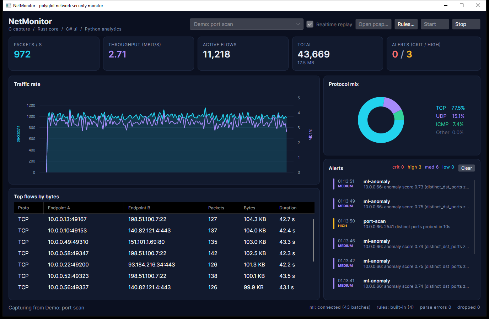

# netmon-polyglot - Network Security Monitor in C, Rust, C# and Python

[](https://github.com/hasanerman/netmon-polyglot/actions/workflows/ci.yml)

A modular network security monitor where every layer is written in the language that suits it best:

- **C** captures raw frames (Npcap / libpcap, loaded at runtime) or replays pcap files
- **Rust** parses packets, tracks flows, runs a YAML rule engine and exposes a C ABI
- **C#** (Avalonia) draws live charts, top flows and alerts through P/Invoke
- **Python** scores traffic with an Isolation Forest over gRPC and streams anomalies back



Status: all eight development stages are complete. Every component builds, its tests pass, and the values in this README are real measurements.

## Why

The goal is to learn how languages cooperate in one product: C ABI design, P/Invoke, ownership across language boundaries, panics and exceptions at FFI borders, and multi-process architecture over gRPC. The monitor itself is a working tool, not a mock.

## Legal and safety boundary

Capture only on your own machine and on networks you are allowed to monitor. Payloads are never written to disk; only header metadata is processed. No TLS decryption, no packet injection, no blocking (this is an IDS, not an IPS).

## Features

- Parsing: Ethernet (802.1Q / QinQ), IPv4, IPv6 with extension headers, TCP, UDP, ICMP/ICMPv6, DNS questions (with compression pointer loop protection). Link types: Ethernet, BSD loopback (Npcap loopback adapter), raw IP.
- Flow tracking: bidirectional 5-tuple flows, LRU bounded at 100,000 flows, 120 s idle timeout on packet time, top-N by bytes.
- Rule engine (`rules/default.yaml`): `port_scan`, `host_sweep`, `dns_tunnel` (label length + Shannon entropy), `packet_rate`. Sliding windows, per-source cooldown, bounded state (10,000 sources per rule). Rules can be reloaded while capturing; the UI watches the file and hot-reloads on save.
- ML analytics: per-host features (distinct ports, distinct hosts, SYN-only ratio, DNS volume, ...), Isolation Forest combined with a robust (median/MAD) z-score so a scanner inside the training window does not poison the model. Retraining happens in the background while the old model keeps scoring.
- Resilience: the Python service can die and come back; the core keeps working and reconnects with exponential backoff (0.5 s to 30 s). Batches are dropped, never queued, when the link is down.
- Demo mode without Npcap or admin rights: the core can generate synthetic traffic (`mixed`, `portscan`, `dnstunnel`, `flood`) and replay it in real time.
- Headless CLI (`netmon`): generate scenarios, replay pcaps, print stats and alerts. Useful for CI and for testing rules.

## Architecture

```
                         one process                                      separate process
+-------------------------------------------------------------+
|  C# Avalonia UI  (MVVM, LiveCharts, 250 ms poller)          |
|        | P/Invoke (LibraryImport, SafeHandle)                |
|        v                                                     |
|  netcore.dll  (Rust cdylib, C ABI from contracts/core_ffi.h)|        gRPC bidi stream
|    engine: parse -> flows -> rules -> alert queue           | ---- FlowBatch (1/s) ----> +------------------+
|    exporter thread + tokio link (core-grpc)                 | <--- AnomalyScore -------- | Python analytics |
|        ^ callback, frame valid only during the call         |                            | IsolationForest  |
|  C sniffer (compiled into the dll by the cc crate)          |                            +------------------+
|    wpcap.dll / libpcap.so loaded at runtime, or pcap replay |
+-------------------------------------------------------------+
```

Two integration styles are used on purpose:
- C to Rust to C#: same process, lowest latency, raw pointers and opaque handles.
- Rust to Python: separate process over gRPC, so a Python crash or a slow model never touches packet processing.

## Repository layout

111 tracked files.

```
07-network-security-monitor/
  README.md, edu.md, .gitignore
  .github/workflows/ci.yml      windows (msvc) + linux (gcc, asan/ubsan) + python
  contracts/
    core_ffi.h                  generated by cbindgen, the C ABI every consumer uses
    analytics.proto             gRPC contract, compiled for Rust (tonic) and Python
  rules/default.yaml            built-in rules, embedded into the core at compile time
  sniffer-c/                    C capture library + sniff tool + tests
    include/sniffer.h, src/{sniffer,capture_loop,pcap_replay,device,win_npcap,posix_pcap}.c
    tools/sniff.c, tests/{test_replay,test_device}.c, tests/data/sample.pcap
    build.bat (msvc), Makefile (gcc/clang, asan target)
  core-rs/                      Rust workspace
    core/        netcore-engine: packet/, flow, rules/, engine, pcap, synth, alert
    core-ffi/    netcore.dll: C ABI, sniffer binding, analytics exporter, cbindgen
    core-grpc/   tonic client with reconnect/backoff
    cli/         netmon command line tool
  ui-cs/                        .NET 10
    src/NetMonitor.Interop      NativeMethods, CoreHandle, structs, NetCoreSession, StatsPoller
    src/NetMonitor.App          Avalonia views and view models
    tests/NetMonitor.Tests      interop and poller tests (xUnit)
  analytics-py/                 grpc server, features, model, tests, benchmark
  scripts/                      build_all, run_all, bench, gen_contracts, screenshot
  docs/screenshot.png
```

## C ABI (contracts/core_ffi.h)

```c
NcCore *core_create(const NcConfig *config);          /* NULL config = defaults, built-in rules on */
void    core_destroy(NcCore *core);                   /* stops capture and analytics first */
int32_t core_open_live(NcCore *, const char *iface, uint8_t promisc);
int32_t core_open_file(NcCore *, const char *path, uint8_t realtime);
int32_t core_start(NcCore *);  int32_t core_stop(NcCore *);
int32_t core_feed_packet(NcCore *, uint64_t ts_us, const uint8_t *data, uint32_t caplen, uint32_t wire_len);
int32_t core_poll_stats(NcCore *, NcStats *out);
int32_t core_poll_top_flows(NcCore *, NcFlow *out, uint32_t capacity, uint32_t *written);
int32_t core_poll_alert(NcCore *, NcAlert *out);      /* 1 = alert written, 0 = empty */
int32_t core_load_rules(NcCore *, const char *yaml);  /* returns active rule count */
int32_t core_connect_analytics(NcCore *, const char *endpoint);
int32_t core_list_devices(NcDevice *out, uint32_t capacity, uint32_t *total);
int32_t core_write_demo_pcap(const char *path, uint32_t scenario, uint32_t packets, uint64_t seed);
int32_t core_last_error(const NcCore *, char *buf, uint32_t len);
```

Rules at the border:
- Negative return values are `NcStatus` codes; the message is copied into a caller buffer by `core_last_error`, so no string ever crosses the border with foreign ownership.
- Every exported function runs inside `catch_unwind`; a Rust panic becomes `NC_STATUS_PANIC`.
- Structs are `#[repr(C)]`, enums travel as fixed-width integers, booleans as `u8`. Sizes are asserted in Rust (`size_of`/`offset_of`), C (`_Static_assert`) and C# (`Unsafe.SizeOf`): NcStats 200, NcFlow 88, NcAlert 304, NcDevice 516 bytes.
- CI fails if the checked-in header differs from what cbindgen generates.

## Language comparison (measured)

| Topic | C (sniffer) | Rust (core) | C# (UI) | Python (analytics) |
|---|---|---|---|---|
| Role | capture, pcap replay | parsing, flows, rules, ABI | visualisation | ML scoring |
| Memory management | manual, goto cleanup | ownership, `unsafe` only at the border | GC + `SafeHandle` | GC (refcount) |
| Error model | `sniffer_status` codes | `Result`, `NcStatus` at the border | exceptions (`NetCoreException`) | exceptions, gRPC status codes |
| Concurrency | CreateThread / pthread, atomic stop flag | `Mutex`, tokio current-thread runtime | `PeriodicTimer`, UI dispatcher | grpc thread pool + trainer thread |
| Boundary | `sniffer.h` callback | `core_ffi.h` (cbindgen) | `LibraryImport` | `analytics.proto` |
| Tests | 84 checks (2 programs) | 64 tests incl. proptest | 11 xUnit tests | 14 pytest tests |
| Non-blank lines | 1,302 | 4,341 | 1,809 | 612 |
| Throughput | 2.86 M pkt/s pcap replay | 3.55 M pkt/s parse, 2.39 M pkt/s with 4 rules | 4 Hz refresh, ~1,000 pkt/s demo shown live | 314,000 flows/s scoring |
| Peak memory | 3.4 MB (1 M packets) | 4.6 MB typical, 22.2 MB at 100,000 flows | 165-176 MB | 231 MB (numpy + sklearn) |
| Binary size | sniff.exe 20 KB | netcore.dll 1,915 KB (incl. tokio/tonic), netmon.exe 458 KB | framework dependent | interpreted |

Measurement environment: AMD Ryzen 5 8400F (6 cores, 12 threads), Windows 10 22H2, Rust stable (release, thin LTO), MSVC 18, .NET 10, Python 3.12. Replay figures use 1,000,000 synthetic packets from `netmon gen` and include file I/O. The UI memory was sampled at 15 s and 55 s of a real-time port scan demo (165 MB and 173 MB, no growth). Reproduce with `scripts/bench.ps1`.

Detection results on synthetic traffic (1,000,000 packets per scenario, built-in rules):

| Scenario | Rule alerts | Anomaly model |
|---|---|---|
| mixed (50 clients, web, ssh, dns, icmp) | 0 | 0 over 20 scored batches (pytest) |
| portscan (1 SYN every 4 packets) | 67 (`port-scan`, 15 s cooldown) | scanner flagged in the live demo, reason `distinct_dst_ports` |
| dnstunnel (48-char base32 labels) | 5 (`dns-tunnel`, critical) | not targeted by the host features |

## Things to keep in mind

C
- The capture callback must stay cheap: the frame pointer is only valid during the call, so the Rust side processes or copies it immediately.
- Windows `Sleep` has ~15 ms granularity. Real-time replay therefore paces against a monotonic wall clock (`QueryPerformanceCounter` / `CLOCK_MONOTONIC`) and only sleeps when it is more than 2 ms ahead.
- `pcap_next_ex` runs with a 100 ms timeout so the stop flag is checked even on a silent interface; `pcap_breakloop` wakes it immediately.

Rust
- The sniffer callback receives a raw pointer to `Shared`; `NcCore::drop` stops analytics and the sniffer before `Shared` can be freed.
- All logic uses packet timestamps, never the wall clock, so replays are deterministic.
- The gRPC link never blocks packet processing: batches are offered with `try_send` and dropped if the link is down or busy.
- The client keeps forwarding batches while waiting for response headers. Python's gRPC server only sends headers with its first reply; waiting first would deadlock (regression test: `server_that_waits_for_first_batch_does_not_deadlock`).

C#
- `CoreHandle : SafeHandle` guarantees `core_destroy`, even on exceptions; a disposed session throws `ObjectDisposedException` instead of touching freed memory.
- Snapshots are produced on a background timer and applied on the UI thread; chart series are bounded to 300 points.
- The Rust build runs automatically as an MSBuild target before the interop project builds (`SkipRustBuild=true` to disable).

Python
- Training runs on its own thread; the old model keeps scoring until the new one is swapped in.
- Inputs are validated (negative or huge counters, empty flows, NaN/inf, oversized batches get `RESOURCE_EXHAUSTED`).

## Build and run

Requirements: Rust stable, .NET 10 SDK, Python 3.11+, Visual Studio Build Tools (MSVC) on Windows or gcc/clang on Linux. Npcap (Windows) or libpcap (Linux) only for live capture; everything else works without it. `protoc` is vendored.

```powershell
scripts\build_all.ps1                 # builds and tests all four components
scripts\run_all.ps1 -Demo portscan    # starts the python service and the UI
```

Individual pieces:

```powershell
cargo run --release --manifest-path core-rs/Cargo.toml --bin netmon -- gen portscan scan.pcap --packets 200000
cargo run --release --manifest-path core-rs/Cargo.toml --bin netmon -- replay scan.pcap --rules rules/default.yaml
sniffer-c\build.bat ; sniffer-c\build\sniff.exe list
analytics-py\.venv\Scripts\python.exe -m analytics.server --port 50051
dotnet run --project ui-cs/src/NetMonitor.App -- --demo dnstunnel --analytics http://127.0.0.1:50051
```

UI arguments: `--demo portscan|dnstunnel|mixed`, `--analytics <url>`, `--no-analytics`.

## Tests

- C: replay correctness, max frames, threaded start/stop, real-time stop latency, truncated files, bad magic; device listing when a capture library exists. `make asan` runs everything under AddressSanitizer and UBSan.
- Rust: parser unit tests plus proptest fuzzing (random and mutated frames never panic), flow table eviction/expiry/bounds, pcap edge cases, rule false-positive and detection tests, ABI layout tests, a full C sniffer replay through the C ABI, gRPC round trip with server restart.
- C#: struct sizes, marshalling of flows and alerts, error mapping, dispose semantics, rule reload, analytics state, poller rates with a fake clock.
- Python: feature extraction, warmup, detection with a contaminated warmup, retraining while serving, full gRPC stream against a real server.

## Acceptance criteria

- [x] pcap replay and live capture go through the same path (same callback, same engine)
- [x] C# loads the Rust library, receives stats and alerts, and releases it cleanly
- [x] The Python service can be killed and restarted; the core keeps running and reconnects
- [x] A port scan is detected both by a rule and by the anomaly model
- [x] Values in this README are measured, edu.md is complete

## License

MIT
